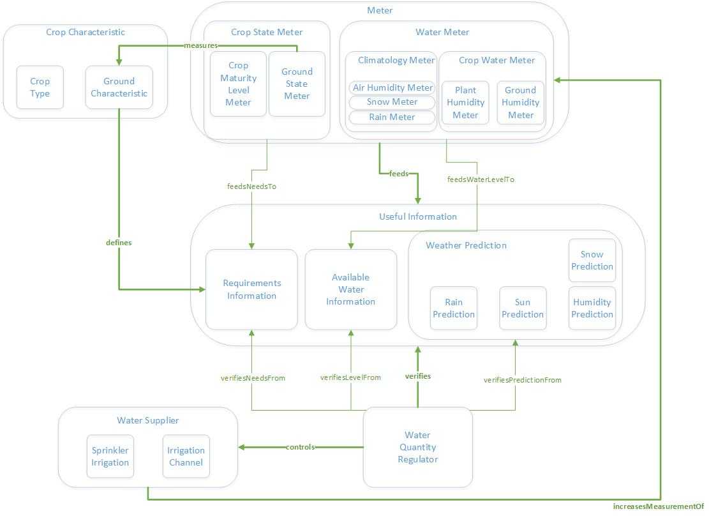

# Crop Water Consumption Ontology (Version 1.0)

Designed by:
------------

This ontology has been developed by the following CES IA students at Telecom Evolution (Telecom Paris):

-	Francisco Romero (francisco.rs00@gmail.com)
-	Javier Castells Alvarez-Ossorio (castells.javier@gmail.com)

License:
--------
This ontology use de creative Commons Attribution 4.0 (CC BY 4.0) where You are free to:

  - Share: copy and redistribute the material in any medium or format.
  - Adapt: remix, transform, and build upon the material for any purpose, even commercially.

URL of the Ontology:
--------------------
In the next URL (Github repository) you can find the OWL file created by Protégé application (V.5.5.0):

https://github.com/javiercastells/CES-IA-Telecom-Paris-/tree/main/Module%205%20-%20Symbolic%20IA/TP/Report

Ontology Description:
---------------------
As an introduction, due to the problems concerning the famine in Malagascar with big droughts and seeing similar situations in other parts of the world, we see a need for the creation of an ontology to help all these communities in general to effectively manage their water resources for crops. (http://www.fao.org/news/story/es/item/1398817/icode/)

Therefore, in order to solve part of the above problem, we have aimed at solving one of the United Nations Sustainable Development Goals (SDG), specifically on __Goal 15: Life on Land__, we chose to work on the following topic:

__R15.3 - AI to optimize water consumption in crops: AI, together with the use of sensors, would allow making predictions that can improve real water needs, by assessing evaporation, allowing a reduction in its use without harming crops.__

The main objective is to be able to save water, by making the water supply process for crops more efficient. This can be achieved with the help of an Artificial Intelligence, that gathers information from different sensors, and is able to predict the amount of water that the crop well need. In this way, the water supply can be more properly tuned. For example, if the Artificial Intelligence is able to predict potentially dry periods, the water supply could be temporarily increased. Inversely, if the AI predicts a potential excess of water in the crop, the supply can be reduced, to avoid needless use of water. 

With that problem in mind, we made the following considerations in order to build our ontology.

Ontology Design Decisions:
--------------------------
We have based this Ontology on one of the SDG requirements, more specifically R15.3 on AI to optimize water consumption in crops.

In order to control the water needs of a crop, we start by deducing the different elements that make up a crop and those elements that imply the loss of water from the crop. As we progress in this ontology, we deduce 4 main general elements for all crops:
  -	Water Suppliers: Entities that provide water to the crop.
  -	Water Consumers: Entities that remove water from the crop (e.g. evaporation).
  -	Water Quantity: Entities that indicate the amount of water in the crop (humidity in the crop).
  -	Water Regulator: Entity in charge of controlling the amount of water in the crop by providing or not water (through water suppliers) depending on the water consumed by         water consumers.

As we go deeper into these 4 entities and their relationships, we see that to evaluate whether or not we have enough water for a crop depends entirely on the type of crop and the ground on which it is cultivated, so this information is necessary in our study. Following this new idea we see that what is important does not depend on the consumers (external or internal) but on whether we have the necessary water at any given moment for the crop cultivated. This makes us rethink the previous entities and regenerate a new approach to our ontology in which we will define 6 fundamental elements:
1.	__Characteristics of the crop (CropCharacteristic entity):__ This gives an idea of the type of crop that has been used and the physical and mineral characteristics of the           ground on which it has been cultivated, so we will know the water needs it requires. This information is known from the agricultural and mineralogical point of view and         does not depend on any external factor.
2.	__The state of external and internal elements that directly influence the crop:__
      * State of the climate (climatologyState entity)
      * State of the crop (cropStateMeter entity): e.g. state of growth of the crop, soil condition

3.	__Elements measuring__ the different states above (Meter entity):
      * __Crop Water Meter:__ These are meters (sensors) that take measurements concerning how much water is available in the crop (for instance, how humid is the soil and the plants themselves).  
      * __Climatology Water Meter:__ This is another kind of meters focusing on meteorological aspects, such as the quantity of rainwater, snow or even the perceived sun heat. 
      * __Crop State Meter:__  A third kind of meters provide information about maturity of the plants, or even some of the land’s intrinsic characteristics (for instance, the structure and texture of the soil), that might also change in time.

4.	__Useful information to know the water needs (UsefulInformation entity):__ it will determine the amount of water available and needed from the previous meters and the               characteristics of the crop:
    *	Requirements Information: It represents information about the water requirements of the crop. These requirements will be defined by the crop's intrinsic characteristics,       such as: Crop Type, Ground Size, Soil Structure and Soil Texture. Additionally, this information is updated with measurements coming from the Crop State Meters. 
    *	Available Water Information: It represents real time information about the available water in the crop. It is obtained thanks to the Crop Water Meters.
    *	Weather Prediction: This is dynamic information about natural phenomena that affects the crop and that come from Climatology Water Meters.
5.	__Water Regulator (WaterQuantityRegulator entity):__ In charge of, knowing the useful information on water availability and needs, making water supply to the crop or not.

6.	__Water Suppliers (WaterSupplier entity)__:
    *	Irrigation Channel
    *	Sprinkler Irrigation

With these elements we create a closed system in which, knowing the needs of the crop and the soil, theirs states at any given moment and the climatic factors (at any given moment and their prediction), we generate sufficient information to be able to generate a decision to provide water or not by the regulator.

References:
-----------
 - Sustainable Development Goals (UN) - https://www.un.org/sustainabledevelopment/biodiversity/
 - AI for Good - https://ai4good.org/what-we-do/sdg-data-catalog/
 - AI Love SDGs - https://dasci.es/ia4ods/inner-ods-15.html 

  

